# CTF - Catch The Flag

## [Task](https://vk.com/wall-210557050_50)

## Задача `pyeyed` - Reverse 100

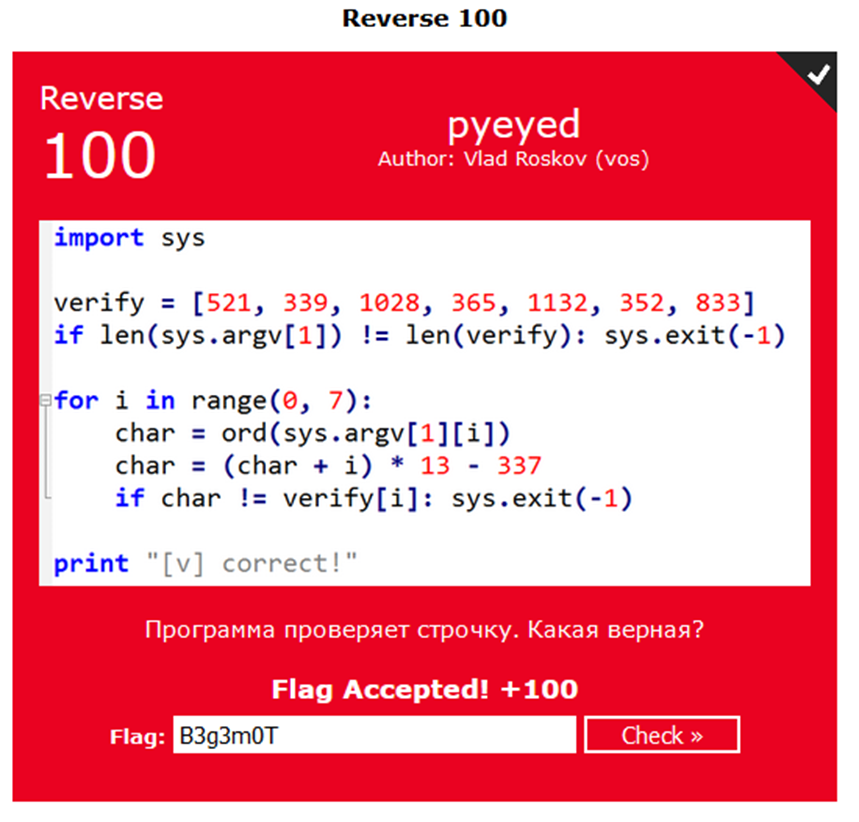

Есть 7 чисел в массиве `verify`. Также в начале проверяется условие наличия 7-ми аргументов при запуске программы ([Про функцию argv из модуля sys](https://docs-python.ru/standart-library/modul-sys-python/funktsija-argv-modulja-sys/));

Далее идёт цикл в семь шагов от 0 до 6; В нём обрабатываются введённые параметры командной строки (далее «параметр») с помощью `argv` и проверяются с числами из списка `verify`; Если число и обработанный параметр не совпадают, программа завершается;

Для того чтобы понять какие параметры командной строки надо ввести, нужно проанализировать их обработку; Обработка происходит в 4-ре этапа:

1) Перевод параметра (который дан в виде Unicode-символа) из символа (char) в его Unicode-код ([С помощью функции ord](https://docs.python.org/3/library/functions.html#ord))
2) Прибавление к полученному коду его порядкового номера (Порядок начинается с нуля)
3) Умножение полученного числа на 13
4) Вычитание из результата, полученного на прошлом шаге, 337

Сразу после 4-ого шага числа (обработанный параметр и число из списка `verify`) сравниваются и, в случае неравенства, программа досрочно завершает работу с помощью функции `exit` из модуля [`sys`](https://docs.python.org/3/library/sys.html);

Для того, чтобы узнать верную последовательность Unicode-символов, введя которые в программу она успешно завершиться (Не досрочно, выведя `“[v] correct!”` в консоль), нужно произвести инвертированный алгоритм обработки для каждого параметра;

Отправной точкой послужит n-ое число из списка `verify`;

1) 521 -> 'B'
   1) 521 + 337 = 858
   2) 858 / 13 = 66
   3) 66 - 0 = 66
   4) 66 -> 'B'
2) 339 -> '3'
   1) 339 + 337 = 676
   2) 676 / 13 = 52
   3) 52 - 1 = 51
   4) 51 -> '3'
3) 1028 -> 'g'
4) 365 -> '3'
5) 1132 -> 'm'
6) 352 -> 'O'
7) 833 -> 'T'

## Задача `theW` - Reverse 100

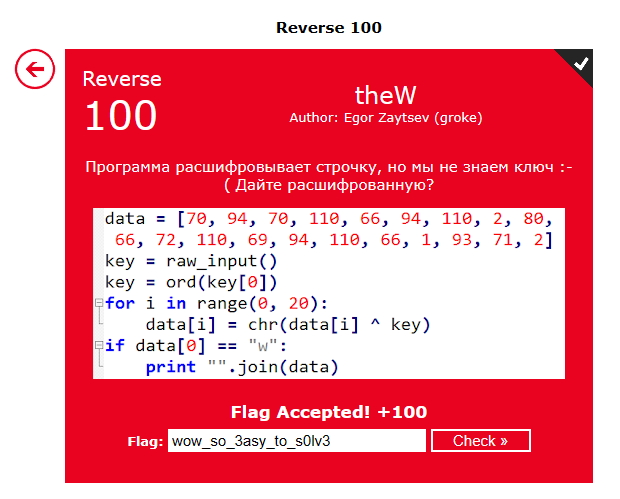

Есть строка в виде массива чисел (Скорее всего это Unicode-коды символов) и ключ, который вводит пользователь. Он неизвестен;

Ключ является Unicode-символом;

Нужно получить расшифрованную строку;

Известны:

1) Зашифрованная строка и алгоритм: символ n XOR ключ = расшифрованный символ n в зашифрованной строке;
2) При расшифровке кода 70 (‘F’) с помощью ключа (key - k), первый символ расшифрованной строки равен 119 (‘w’) => 70 XOR k = 119;

Для того чтобы получить расшифрованную строку, нужно узнать ключ (k);

70 XOR k = 119 => k = 119 XOR 70 = 49 ('1');

Теперь, зная ключ, узнаём расшифрованную строку - `wow_so_3asy_to_s0lv3`

## Задача `%75%72%6c%64 %65%63%6f%64%65` - Web 100

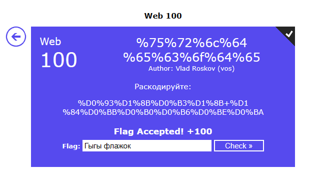

Используем любой инструмент для декодирования URL-символов
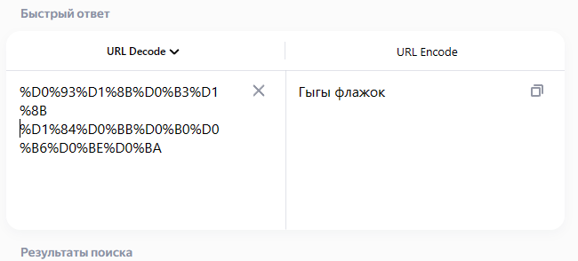

## Задача `quadratic` - Coding 100

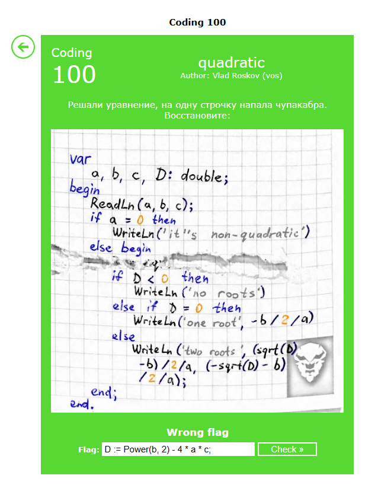

Дан алгоритм решения квадратичного уравнения;

Исходя из логики и алгоритма, пропущена строка получения значения для дискриминанта ('D');

Также стоит учесть, что языком программирования, проверив синтаксис алгоритма, является Pascal;

Примерный ответ: `D := Power(b, 2) - 4 * a * c;`, но он не подходит. Без точки с запятой тоже не проходит...

**`Не засчитано :(`**

## Задача `— Ыыы` - OSINT 100

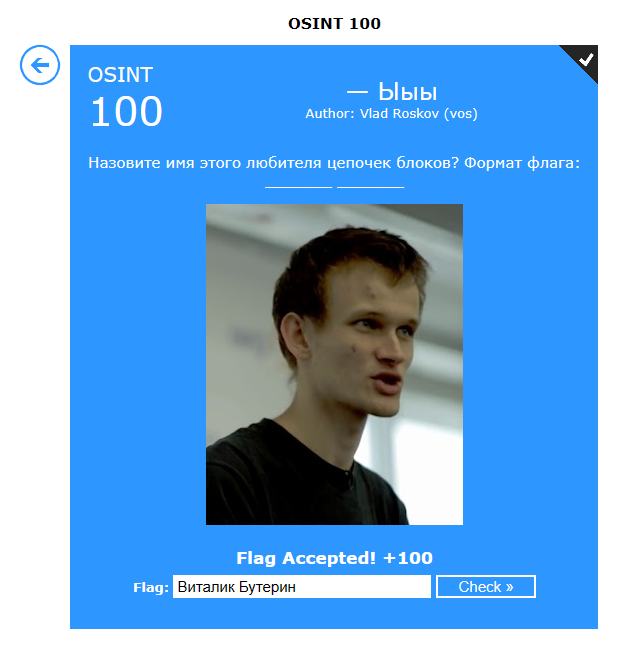

Дано изображение человека. Ищем его в поисковике изображений;

В моём случае это яндекс.картинки

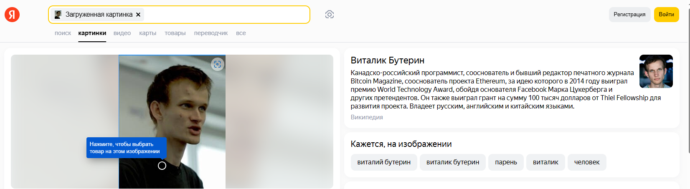

### Задача `Five` - Mic Check

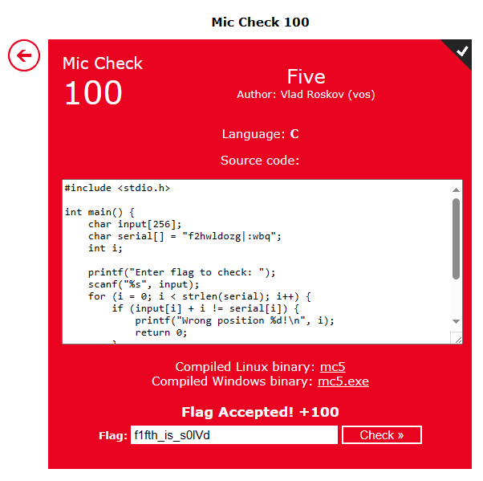

Полный аглоритм

```C
#include <stdio.h>

int main() {
    char input[256];
    char serial[] = "f2hwldozg|:wbq";
    int i;

    printf("Enter flag to check: ");
    scanf("%s", input);
    for (i = 0; i < strlen(serial); i++) {
        if (input[i] + i != serial[i]) {
            printf("Wrong position %d!\n", i);
            return 0;
        }
    }
    printf("Yes! Correct flag is %s\n", input);
    return 0;
}
```

Есть строка `serial` и вводимый флаг, в виде строки;

Флаг обязан пройти посимвольную обработку и свериться посимвольно со строкой `serial`:

1) i-ый символ флага конвертируется в число
2) Число суммируется с его порядковым номером (Отсчёт начинается с нуля)
3) Полученный результат сравнивается с i-ым символом `serial` переведённым в число

Инвертируем аглоритом и получаем наш флаг в виде строки;

```python
serial = [c for c in "f2hwldozg|:wbq"]
# ['f', '2', 'h', 'w', 'l', 'd', 'o', 'z', 'g', '|', ':', 'w', 'b', 'q']
for i in range(len(serial)):
    serial[i] = (ord(serial[i]) - i)
# [102, 49, 102, 116, 104, 95, 105, 115, 95, 115, 48, 108, 86, 100]
print("".join(chr(i) for i in serial))
# f1fth_is_s0lVd
```

Флаг - `f1fth_is_s0lVd`

### Задача `Perl` - Reverse 100

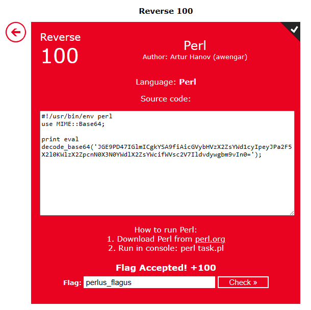

Хоть это и язык программирования Perl, видим, что здесь используется метод `decode_base64`;

Пробуем расшифровать данной кодировкой строку и узнаём значение флага

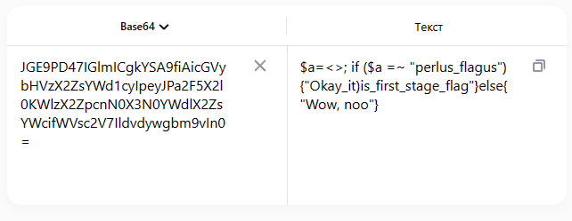

### Задача `captain` - Reverse 100

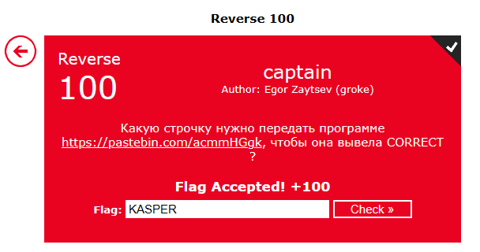

Код по ссылке:

```C
#include <stdio.h>
#include <string.h>

int main(int argc, char *argv[])
{
    char a[] = "J@RODQ";

    if (argc != 2) {
        puts("WRONG!");
        return -1;
    }

    if (strlen(argv[1]) != (sizeof(a) - 1)) {
        puts("WRONG!");
        return -1;
    }

    for (int i = 0; i < sizeof(a)-1; i++) {
        if (argv[1][i] - !!a != a[i]) {
            puts("WRONG!");
            return -1;
        }
    }
    
    puts("CORRECT!");

    return 0;
}
```

#### Справка

[По источникам](https://en.cppreference.com/w/c/language/main_function) известно, что `argc` - количество переменных, переданных через командную строку, а `argv` - указатель на первый элемент массива переданных переменных;

По алгоритму видно, что верификация флага происходит в 3 этапа;

#### `1) argc == 2`

Из источника о `argv`, знаем что
> If argv[0] is not a null pointer (or, equivalently, if argc > 0), it points to a string that represents the program name, which is empty if the program name is not available from the host environment.

Следовательно `argv[0]` - имя испольняемого файла, а `argv[1]` - наш флаг;

Следовательно наш флаг должен состоять из одно слова;

#### `2) strlen(argv[1]) == (sizeof(a) - 1)`

Длина флага равна размеру типа `char` - 1, ибо `sizeof(a)` вернёт `sizeof(char)`, умноженное на колличество символов с строке;

[`sizeof(char) = 1 байт`](https://en.cppreference.com/w/c/language/arithmetic_types#Character_types) => `sizeof(a) = 6`, т.к. в строке `a` 6 символов.

Отсюда следует, что длина флага должна быть равна 6-ти символам;

#### `3) for i = 0..len(a) - 1: flag[i] - !!a == a[i]`

Проходясь по всей длине строки `a`, нужно чтобы каждый символ флага в виде числа, у которого отняли единицу, был равен i-му символу строки `a` в виде числа

Сначала разберём строку `a` на значения символов с помощью [таблицы](https://en.cppreference.com/w/c/language/charset):

| Символ | Числовое значение |
|--:|:--|
|J|74|
|@|64|
|R|82|
|O|79|
|D|68|
|Q|81|

Зная данный значения => `flag[i] = a[i] + !!a`

[О логических операциях в языке `C`](https://en.cppreference.com/w/c/language/operator_logical)

> int n = isspace('a'); // zero if 'a' is a space, nonzero otherwise  
> int x = !!n; // "bang-bang", common C idiom for mapping integers to [0,1]  
> // (all non-zero values become 1)

Т.к. `a` - массив, то при применении на нём логического операнда, он *превращается* в `false` (если пустой? или является `null_ptr`) и в `true` в иных случаях;

[О приведении типов в языке C;](https://en.cppreference.com/w/c/language/conversion)

> A value of any scalar type can be implicitly converted to _Bool(until C23)bool(since C23). The values that compare equal to an integer constant expression of value zero(until C23)are a zero (for arithmetic types), null (for pointer types) or have a type of nullptr_t(since C23) are converted to ​0​(until C23)false(since C23), all other values are converted to 1(until C23)true(since C23).

Отсюда следует, что выражение `!!a` всегда будет равно `1`;

Тогда `flag[i] = a[i] + 1` -> `75 65 83 80 69 82` -> `KASPER`

### Задача `Two` - Mic Check 40

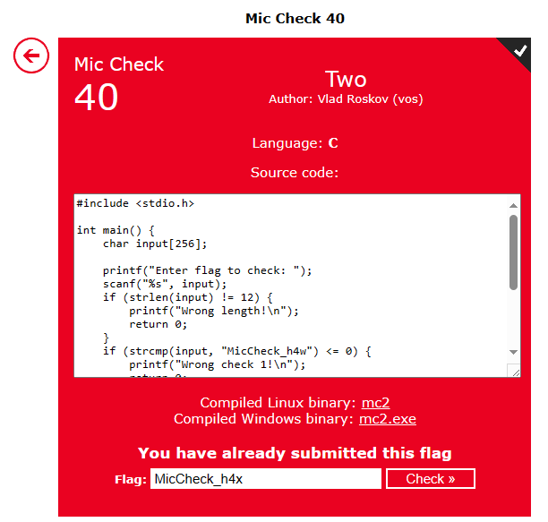

Весь код:

```C
#include <stdio.h>

int main() {
    char input[256];

    printf("Enter flag to check: ");
    scanf("%s", input);
    if (strlen(input) != 12) {
        printf("Wrong length!\n");
        return 0;
    }
    if (strcmp(input, "MicCheck_h4w") <= 0) {
        printf("Wrong check 1!\n");
        return 0;
    }
    if (strcmp(input, "MicCheck_h4y") >= 0) {
        printf("Wrong check 2!\n");
        return 0;
    }
    printf("Yes! Correct flag is %s\n", input);
    return 0;
}
```

Алгоритм:

1) Ввести ключ/флаг
2) Произвести 3 проверки, в случае провала которых ключ не засчитывается
   1) Проверка длинны ключа: ключ должен состоять из 12-ти символов
   2) Лексикографическое сравнение строк: ключ и "MicCheck_h4w"
   3) Лексикографическое сравнение строк: ключ и "MicCheck_h4y"
3) В случае прохождения всех проверок, ключ засчитывается

Я просто начал изменять последнюю букву и по итогу ключ сработал с 3-ей попытки на значении `MicCheck_h4x`

### Задача `Thee` - Mic Check - 60

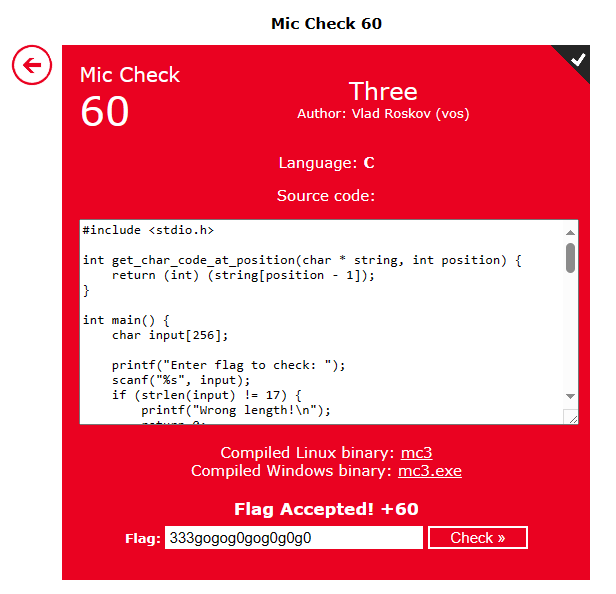

Весь код:

```C
#include <stdio.h>

int get_char_code_at_position(char * string, int position) {
    return (int) (string[position - 1]);
}

int main() {
    char input[256];

    printf("Enter flag to check: ");
    scanf("%s", input);
    if (strlen(input) != 17) {
        printf("Wrong length!\n");
        return 0;
    }
    if (atoi(input) != 333) {
        printf("Wrong check 1!\n");
        return 0;
    }
    if (get_char_code_at_position(input, 5) != 'o') { printf("No \"o1\"!\n"); return 0; }
    if (get_char_code_at_position(input, 7) != 'o') { printf("No \"o2\"!\n"); return 0; }
    if (get_char_code_at_position(input, 11) != 'o') { printf("No \"o3\"!\n"); return 0; }

    if (get_char_code_at_position(input, 9) != get_char_code_at_position(input, 13)) { printf("Wrong check 2!\n"); return 0; }
    if (get_char_code_at_position(input, 13) != get_char_code_at_position(input, 15)) { printf("Wrong check 3!\n"); return 0; }
    if (get_char_code_at_position(input, 17) != get_char_code_at_position(input, 9)) { printf("Wrong check 4!\n"); return 0; }

    if (get_char_code_at_position(input, 4) != get_char_code_at_position(input, 6)) { printf("Wrong check 5!\n"); return 0; }
    if (get_char_code_at_position(input, 4) != get_char_code_at_position(input, 8)) { printf("Wrong check 6!\n"); return 0; }
    if (get_char_code_at_position(input, 4) != get_char_code_at_position(input, 10)) { printf("Wrong check 7!\n"); return 0; }
    if (get_char_code_at_position(input, 4) != get_char_code_at_position(input, 12)) { printf("Wrong check 8!\n"); return 0; }
    if (get_char_code_at_position(input, 4) != get_char_code_at_position(input, 14)) { printf("Wrong check 9!\n"); return 0; }
    if (get_char_code_at_position(input, 4) != get_char_code_at_position(input, 16)) { printf("Wrong check 10!\n"); return 0; }

    if (get_char_code_at_position(input, 16) != 'g') { printf("No \"g\"!\n"); return 0; }
    if (get_char_code_at_position(input, 9) != '0') { printf("No zero!\n"); return 0; }

    printf("Yes! Correct flag is %s\n", input);
    return 0;
}
```

Все символы ключа, кроме ё-х первых находяться через логику;

`get_char_code_at_position(input, 4) != get_char_code_at_position(input, 12))`

=>

если 4-ый символ флага не равен 12-ому символу флага, то ключ не засчитан;

Флаг = `---gogog0gog0g0g0`

А первые 3 символа флага узнаём из-за метода [`atoi`](https://en.cppreference.com/w/c/string/byte/atoi)

К примеру: `printf("%i\n", atoi(" -123junk"));` выведет `-123`;

Следовательно, если `atoi(input) != 333`, тогда первые три символа флага это `333`

Флаг = `333gogog0gog0g0g0`

### Задача `Sakura` - Coding 200

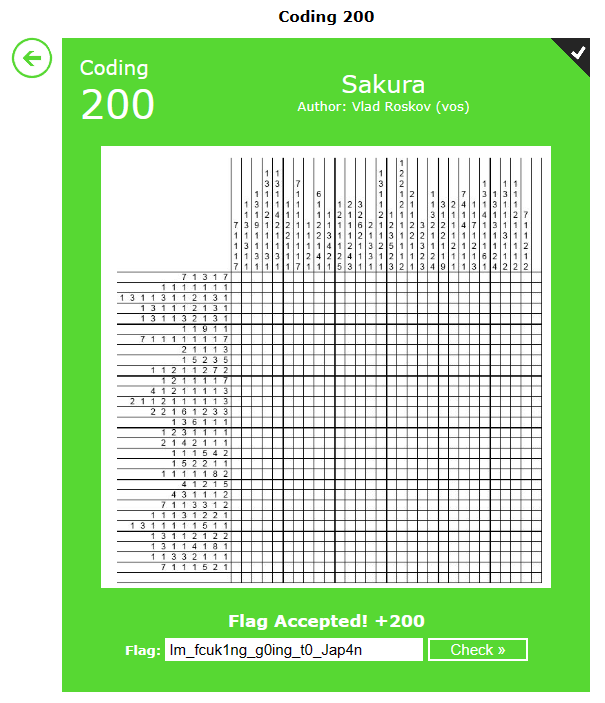

Это обычная нонограмма (японский кроссворд);

Решение подобного - это достаточно длительный для меня процесс, потому я воспользовался [инструментом для решения нонограм](https://freshman.dev/raw/nonogram/);

Ответом вышел QR-код:

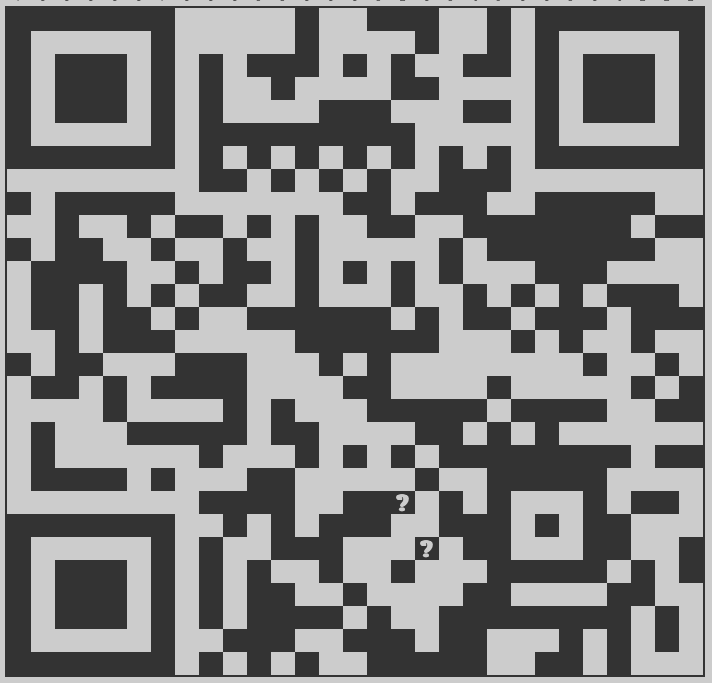

Закодированное сообщение в QR-коде - `Flag: Im_fcuk1ng_g0ing_t0_Jap4n`

## Конец - сумма всех набранных очков не меньше 1000
